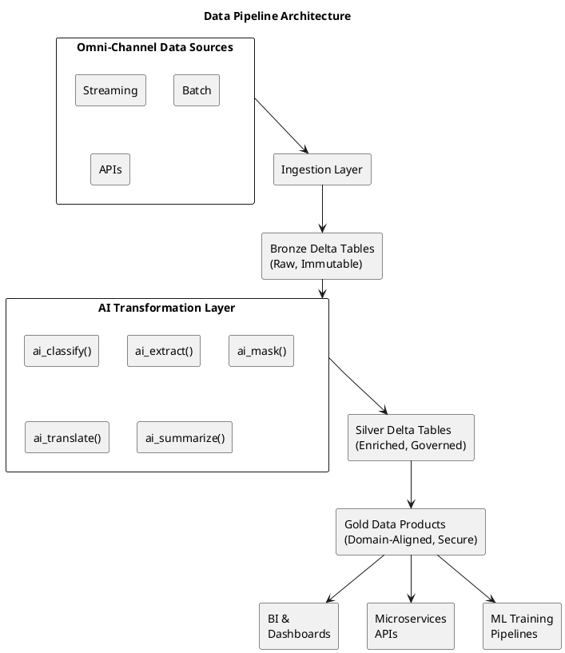

# McDonald’s Enterprise AI-Infused Data Pipelines on Databricks: <sub>Omni-Channel Guest Experience, Governance, and Domain-Driven Architecture</sub>
#### *Designing intelligent, governed, and scalable enterprise data products using Databricks, Unity Catalog, and AI-powered pipelines — aligned with McDonald’s global omni-channel strategy.*

--- 

## Repository Overview 

##### McDonald’s operates one of the most complex global omni-channel enterprises in the world — spanning in-restaurant POS, drive-thru, mobile apps, kiosks, delivery platforms, customer support, and global franchises.

This repository demonstrates how a Principal Enterprise Architect can:

- Bridge the gaps between Data, Software/Microservices, and AI teams
- Design AI-infused enterprise data pipelines
- Govern data at scale using Unity Catalog
- Enable omni-channel customer intelligence
- Apply Domain-Driven Design (DDD) to enterprise data products
- Translate raw, unstructured signals into business-ready intelligence

While the role itself may not neccessarily be hands-on coding, this repo proves architectural depth across:

- Enterprise data platforms

- Cloud-native patterns

- AI integration

- Governance & compliance

- Cross-domain collaboration

---

## Why This Matters to McDonald’s

#### McDonald’s strategic priorities include:

- Customer experience at global scale

- Consistency across channels

- Localized execution with centralized governance

- AI-enabled personalization

- Operational excellence

- This architecture shows how AI moves from experimentation into enterprise production.

---

## Architecture Vision: AI-Infused Enterprise Data Pipelines

##### While the complete architectural vision for a McDonald's Principal Achitect could be found at:   

##### The discussion and approach in this repository highlights one aspect of the core vision. 

##### <ins>From Traditional ETL to Intelligent Data Products</ins>

##### Traditional ETL pipelines:

- Break on schema changes

- Struggle with unstructured data

- Require manual governance

- Do not understand meaning

##### *AI-Infused Pipelines transform raw data into intelligent, reusable enterprise assets.*

---

## Core Capabilities Demonstrated in This Project

#### <ins>1. Understand Content</ins>
Sentiment analysis, classification, summarization

#### <ins>2. Automate Governance</ins>
PII detection and masking using AI

#### <ins>3. Self-Adapt</ins>
Grammar correction, entity extraction, schema evolution

#### <ins>4. Globalize</ins>
Multilingual translation for global operations

> [!IMPORTANT]
> Please see Miscellaneous for snapshots of how AI functions are inserted on McDonald's customers' reviews data pipeline. Only the high level AI parts are shown in this project. Interested users (with .ipynb IDEs) can also download the reveiews and codes for this repository and run it as stand-alone project without the Data Lake/Unity Catalog backends.
>
> 

---

## High-Level Architecture

## Data Pipeline Architecture

```python
┌────────────────────────┐
│ Omni-Channel Data │
│ Sources │
│ ┌────────────────┐ │
│ │ Streaming │ │
│ │ Batch │ │
│ │ APIs │ │
│ └────────────────┘ │
└──────────┬─────────────┘
│
▼
┌────────────────────────┐
│ Ingestion Layer │
│ (Auto Loader, JDBC) │
└──────────┬─────────────┘
│
▼
┌────────────────────────┐
│ Bronze Delta Tables │
│ (Raw, Immutable) │
└──────────┬─────────────┘
│
▼
┌────────────────────────┐
│ AI Transformation │
│ • ai_classify() │
│ • ai_extract() │
│ • ai_mask() │
│ • ai_translate() │
│ • ai_summarize() │
└──────────┬─────────────┘
│
▼
┌────────────────────────┐
│ Silver Delta Tables │
│ (Enriched, Governed) │
└──────────┬─────────────┘
│
▼
┌────────────────────────┐
│ Gold Data Products │
│ (Domain-Aligned) │
└──────────┬─────────────┘
│
┌───────┴───────┐
▼ ▼ ▼
┌─────────┐ ┌─────────┐ ┌─────────────┐
│ BI & │ │Micro- │ │ ML Training │
│Dash- │ │services │ │ Pipelines │
│boards │ │ APIs │ │ │
└─────────┘ └─────────┘ └─────────────┘

```


## **Option 3: Enhanced ASCII with Unicode**
```markdown
# Medallion Architecture with AI Layer

┌───────────────────────────────────────────────┐
│            Omni-Channel Data Sources          │
│  🔄 Streaming │ 📦 Batch │ 🔗 APIs            │
└───────────────────────┬───────────────────────┘
                        │
                        ▼
┌───────────────────────────────────────────────┐
│              Ingestion Layer                   │
│      (Auto Loader, JDBC, Partner Connectors)  │
└───────────────────────┬───────────────────────┘
                        │
                        ▼
┌───────────────────────────────────────────────┐
│           Bronze Layer (Raw)                   │
│        • Preserve raw data                    │
│        • Append-only                         │
│        • Schema-on-read                      │
└───────────────────────┬───────────────────────┘
                        │
                        ▼
┌───────────────────────────────────────────────┐
│         AI Transformation Layer                │
│  • `ai_classify()` - Fraud detection          │
│  • `ai_extract()` - Entity extraction         │
│  • `ai_mask()` - PII protection               │
│  • `ai_translate()` - Multilingual support    │
│  • `ai_summarize()` - Document summarization  │
└───────────────────────┬───────────────────────┘
                        │
                        ▼
┌───────────────────────────────────────────────┐
│           Silver Layer (Cleaned)               │
│        • Validated data                       │
│        • Standardized schemas                 │
│        • Business-ready                       │
└───────────────────────┬───────────────────────┘
                        │
                        ▼
┌───────────────────────────────────────────────┐
│            Gold Layer (Curated)                │
│        • Domain-aligned                       │
│        • Aggregated metrics                   │
│        • Feature engineered                   │
└───────────────────────┬───────────────────────┘
           ┌────────────┼────────────┐
           │            │            │
           ▼            ▼            ▼
    ┌──────────┐  ┌──────────┐  ┌──────────┐
    │📊 BI &    │  │⚡ Micro- │  │🤖 ML     │
    │ Dashboard│  │ services │  │ Training │
    │          │  │ APIs     │  │ Pipeline │
    └──────────┘  └──────────┘  └──────────┘
```

## **Option 4: Simple Text with Icons**
```markdown
## Data Pipeline Flow

**1. 📥 Data Sources**
   - 🔄 Streaming data (Kafka, Event Hubs)
   - 📦 Batch files (S3, ADLS)
   - 🔗 APIs (REST, GraphQL)

**2. ⬇️ Ingestion Layer**
   - Auto Loader for cloud storage
   - JDBC for databases
   - Partner connectors for SaaS apps

**3. 🥉 Bronze Layer** *(Raw Delta Tables)*
   - Raw, immutable data
   - Schema enforcement
   - Data quality checks

**4. 🧠 AI Transformation**
   - `ai_classify()` - Categorization
   - `ai_extract()` - Entity extraction
   - `ai_mask()` - Privacy protection
   - `ai_translate()` - Language processing
   - `ai_summarize()` - Content condensation

**5. 🥈 Silver Layer** *(Cleaned Delta Tables)*
   - Enriched with AI insights
   - Validated and governed
   - Ready for consumption

**6. 🥇 Gold Layer** *(Curated Data Products)*
   - Domain-aligned data marts
   - Secure access controls
   - Optimized for performance

**7. 📤 Consumption Layer**
   - 📊 BI & Dashboards (Tableau, Power BI)
   - ⚡ Microservices APIs
   - 🤖 ML Training Pipelines
```

## **Option 5: PlantUML (If Supported)**
````markdown



